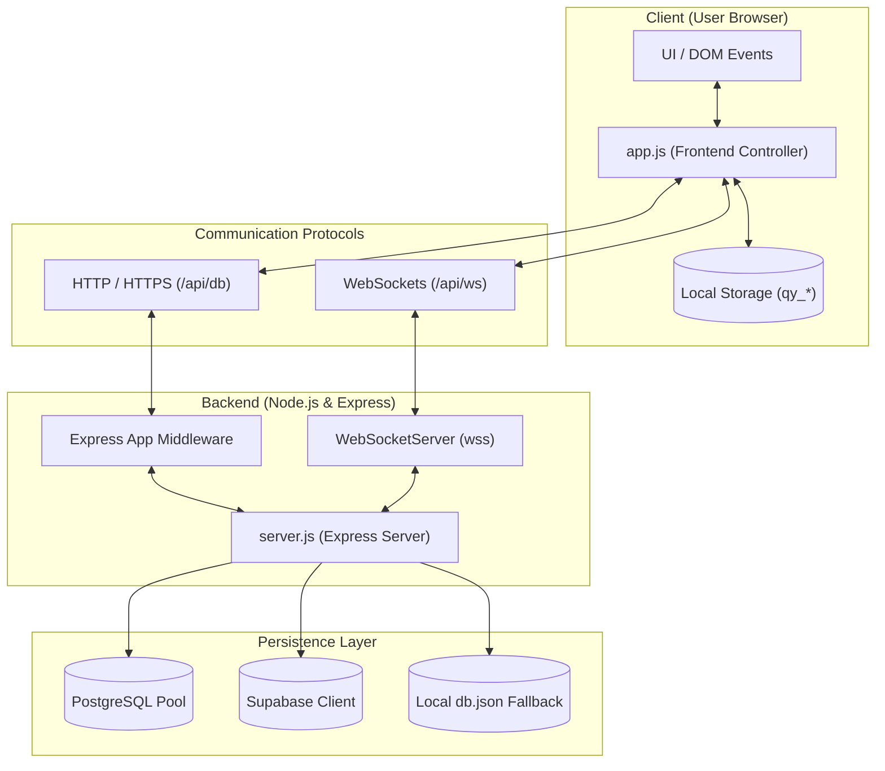
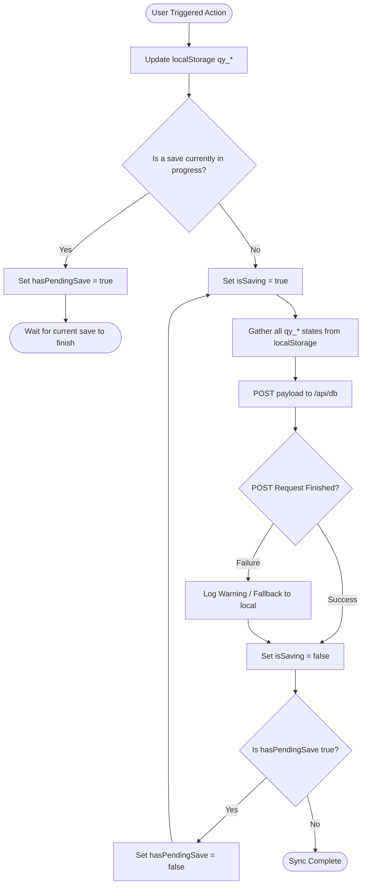
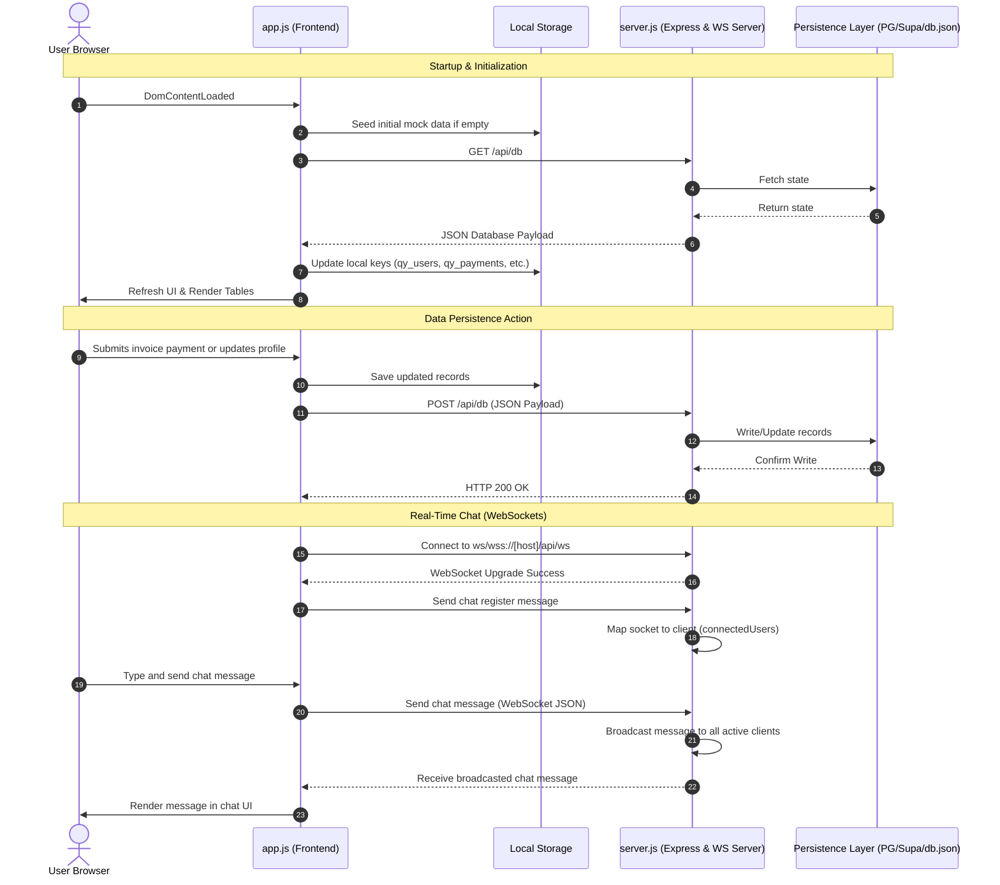

# Quantum Yoga System Architecture

This document provides visual diagrams and detailed descriptions of the system architecture, workflows, and communication sequences between the frontend application ([app.js](file:///d:/QuantumYogaWebsite/app.js)) and the backend server ([server.js](file:///d:/QuantumYogaWebsite/server.js)).

---

## 1. Container & Component Architecture

This diagram illustrates the separation between the client-side user interface and the server-side components, including data storage paths.

---

## 2. Data Synchronization Workflow

This workflow diagram describes how local changes are queued and synced to the server using the `isSaving` and `hasPendingSave` state machine flags to prevent parallel request overlap.

---

## 3. Communication & Operations Sequence

This sequence diagram depicts startup synchronization, database persistence, and WebSocket real-time chat operations.

